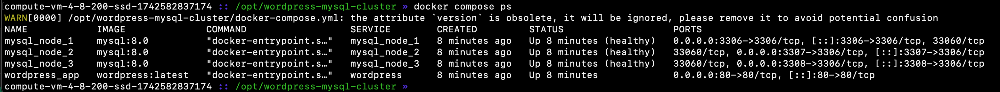
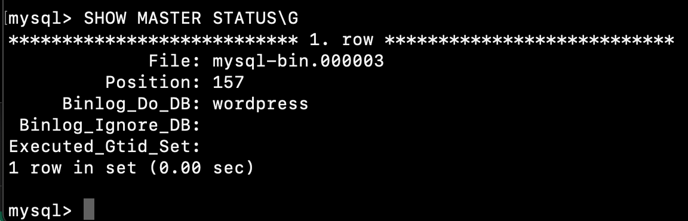
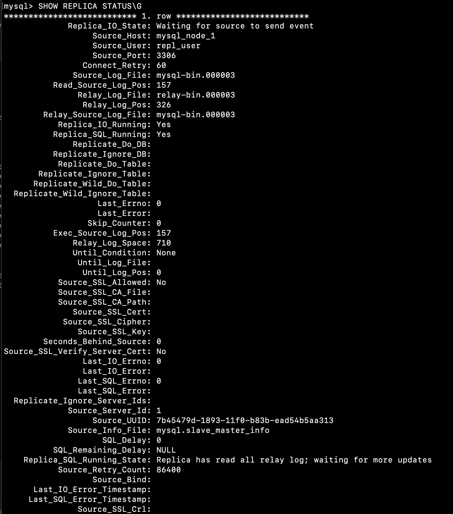

# Настройка кластера MySQL для WordPress

Этот проект содержит Ansible роли и playbook для замены стандартной базы данных MySQL для WordPress на отказоустойчивый кластер MySQL с поддержкой репликации данных и автоматической синхронизацией.

## Особенности

- Использует модуль `community.mysql.mysql_replication` для автоматической настройки репликации

## Использование

1. Добавьте хост в inventory.ini:
   ```
   [wordpress_server]
   your_server_ip
   ```

2. Настройте переменные группы в group_vars/wordpress_server:
   ```yaml
   mysql_root_password: "secure_root_password"
   mysql_database: "wordpress"
   mysql_user: "wordpress"
   mysql_password: "secure_password"
   repl_user: "repl_user"
   repl_password: "secure_repl_password"
   wp_table_prefix: "wp_"
   ```

3. Запустите playbook:
   ```bash
   ansible-playbook mysql-cluster-playbook.yml -i inventory.ini
   ```

## Настройка кластера

Вы можете изменить параметры кластера, переопределив переменные роли в вашем playbook или в group_vars:

```yaml
mysql_cluster_nodes: 5  # Увеличить количество узлов кластера до 5
```

## Проверка работы кластера

1. Подключение к основному узлу:
   ```
   ssh ansible@your_server_ip
   docker exec -it mysql_node_1 mysql -uroot -p
   ```
   

2. Проверка статуса мастера:
   ```sql
   SHOW MASTER STATUS;
   ```
   
3. Проверка статуса репликации:
   ```sql
   SHOW REPLICA STATUS\G;
   ```
   
   