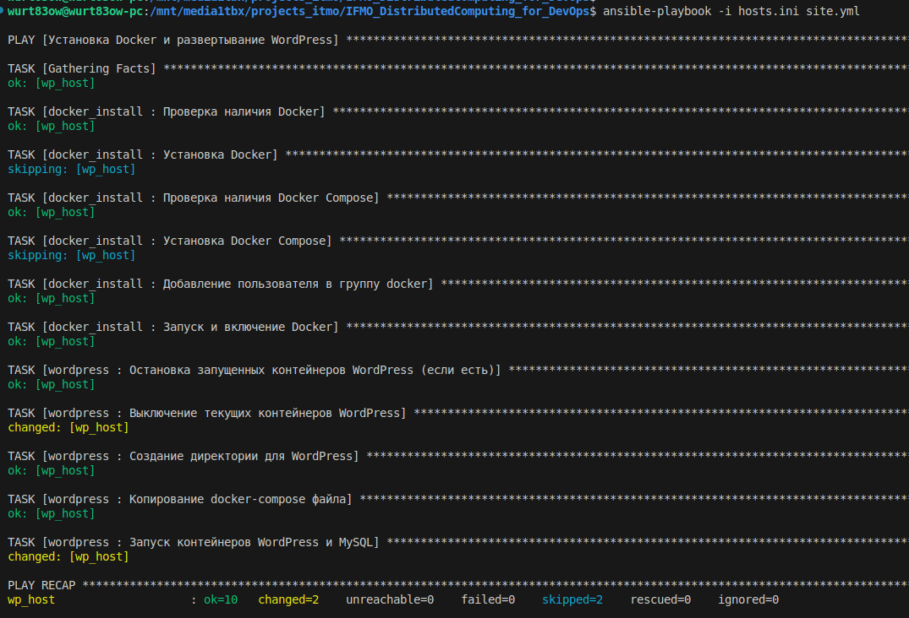

# IFMO_DistributedComputing_for_DevOps
Distributed Computing course for DevOps 2025

# WordPress с Docker и Ansible

## Описание

Данный проект автоматизирует установку Docker и развёртывание WordPress вместе с базой данных MySQL в Docker-контейнерах на удалённом сервере с помощью Ansible. В результате выполнения playbook на указанном сервере будет установлен Docker, Docker Compose, а также развернут WordPress-сайт с базой данных. По умолчанию WordPress будет доступен по HTTP на порту 80 вашего сервера.

## Требования

- **Сервер:** Linux-сервер (например, Ubuntu 20.04) с доступом по SSH и правами для установки пакетов (прямой root-доступ или пользователь с sudo).
- **Локальная машина:** Ansible должен быть установлен на вашей локальной машине (тестировалось с Ansible версии 2.9+).

## Использование

1. Клонируйте репозиторий на вашу локальную машину.
2. Отредактируйте файл `hosts.ini`, указав IP-адрес вашего сервера, имя пользователя для SSH и пароли.
3. Запустите выполнение playbook командой:

   ```bash
   ansible-playbook -i hosts.ini site.yml
   
   
   
