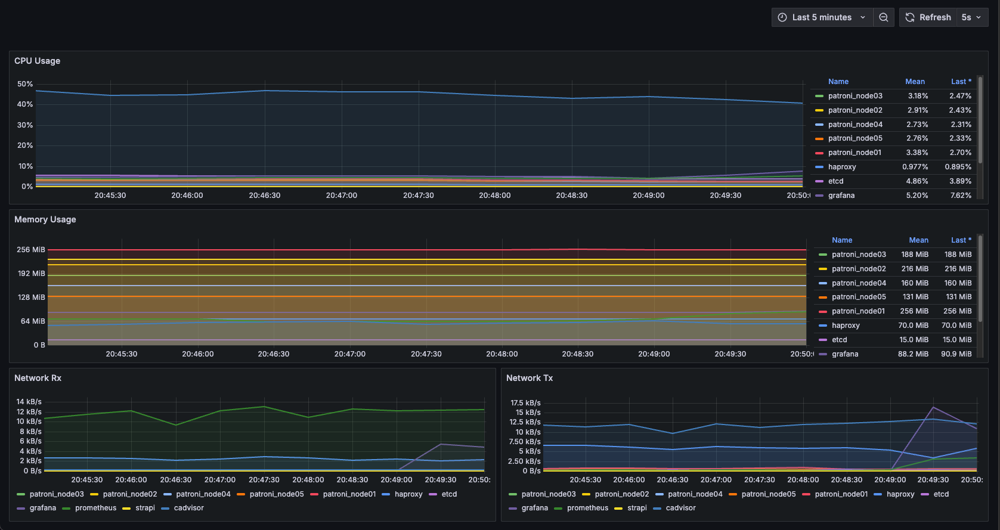

## 📦 Distributed Computing Project: Ansible + Docker + PostgreSQL + Strapi

Проект автоматизирует развёртывание CMS Strapi и PostgreSQL-кластера (мастер + слейв) с помощью **Ansible**, **Docker** и централизованного управления конфигурацией через `.env`.

---

### 📊 Мониторинг (Prometheus + Grafana)


---
### 📌 Зависимости

- Ansible 2.18+
- Коллекция `community.docker`
- Коллекция `community.postgresql`

---

### 📁 Структура

```
IFMO_DistributedComputing_for_DevOps/
├── group_vars/
│   └── all.yml            # Все переменные проекта (.env в Ansible)
│
├── playbooks/
│   ├── docker/
│   │   ├── install.yml     # Установка Docker
│   │   └── remove.yml      # Удаление Docker
│   │
│   ├── hw1/
│   │   ├── install.yml     # Развёртывание HW1 (Strapi + PostgreSQL)
│   │   └── remove.yml      # Очистка HW1
│   │
│   ├── hw2/
│   │   ├── install.yml     # Развёртывание HW2 (PostgreSQL master + replica)
│   │   ├── remove.yml      # Очистка HW2
│   │   └── test.yml        # Проверка репликации в HW2
│   ├── hw3/
│   │   ├── install.yml     # Развёртывание HW3 (cAdvisor + Prometheus + Grafana)
│   │   ├── remove.yml      # Очистка HW3
├── roles/
│   ├── pg_cluster_master/  # Роль для развертывания мастер-базы
│   │   └── tasks/
│   │       └── main.yml
│   │
│   ├── pg_cluster_replica/ # Роль для развертывания реплики базы
│   │   └── tasks/
│   │       └── main.yml
│   │
│   └── strapi/             # Роль для развертывания Strapi
│       └── tasks/
│           └── main.yml
│
├── .env                    # Переменные окружения проекта
├── .gitignore
├── ansible.cfg             # Конфигурация Ansible (пути для ролей и коллекций)
├── inventory.yml           # Инвентарь Ansible
├── Makefile                # Быстрые команды запуска
├── requirements.yml        # Версии зависимостей (ansible модулей)
└── README.md               # Документация проекта
```

---
### 🚀 Команды Makefile

| Команда              | Действие                                                           |
|----------------------|--------------------------------------------------------------------|
| `make init`          | Загружает переменные окружения из `.env`                           |
| `make docker-install` | Устанавливает Docker на сервер                                     |
| `make docker-remove` | Удаляет Docker, его репозитории, ключи, группы и директории        |
| `make hw1-install`   | Разворачивает окружение HW1 (PostgreSQL + Strapi)                  |
| `make hw1-remove`    | Полностью удаляет окружение HW1                                    |
| `make hw2-install`   | Разворачивает окружение HW2 (PostgreSQL кластер master + replica)  |
| `make hw2-remove`    | Полностью удаляет окружение HW2                                    |
| `make hw2-test`      | Проверяет работоспособность репликации и защиту от записи на слейв |
| `make hw3-install`   | Разворачивает окружение HW3 (cAdvisor + Prometheus + Grafana)      |
| `make hw3-remove`    | Полностью удаляет окружение HW3                                    |
---

### ✅ Функциональность

- 🐳 Установка и удаление Docker через Ansible
- 🛠 Развёртывание PostgreSQL master и Strapi CMS (HW1)
- 🔁 Развёртывание кластера PostgreSQL master + replica (HW2)
- 🔐 Вынесение всех паролей и переменных в `.env`
- 📦 Использование Docker volumes для сохранения данных Strapi
- 🌐 Подключение сервисов через отдельные Docker-сети для безопасности
- 🧠 Проверка репликации:
  - Наличие таблицы и данных на реплике
  - Защита слейва от записи (read-only mode)
