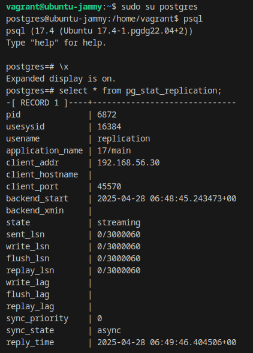
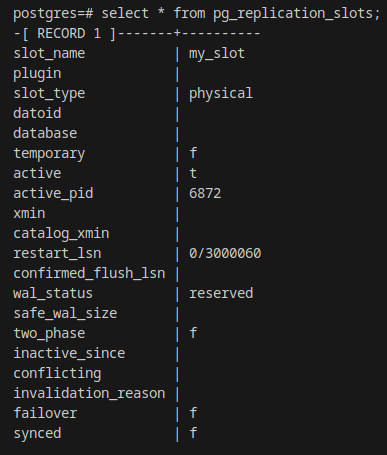
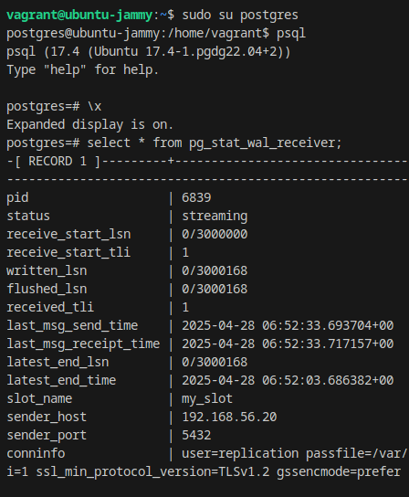

# IFMO_DistributedComputing_for_DevOps
Distributed Computing course for DevOps 2025

# Лабораторная работа №1
# Студент: Денис Бурцев

На удаленном сервере разворачивает через github actions / ansible экземпляр CMS Directus.

Directus доступен по адресу: http://130.193.36.192:8055/admin/login

Admin email: "admin@example.com"
Admin password: "d1r3ctu5"

Альтернатива в виде Directus выбрана в связи с тем, что у wordpress отсутствует поддержка PostgreSQL.

# Лабораторная работа №2
# Студент: Денис Бурцев

Проведен рефакторинг, ключевые изменения: запуск осуществляется на локальной машине, для запуска необходимо установить:

- [VirtualBox](https://www.virtualbox.org/wiki/Downloads)
- [Vagrant](https://developer.hashicorp.com/vagrant/downloads)
- [Ansible](https://docs.ansible.com/ansible/latest/installation_guide/intro_installation.html)

Ключевые изменения: Запускается 3 ВМ на virtualbox с помощью vagrant

Directus запускается в docker контейнере на машине directus

PostgreSQL запускается на ВМ node1-postgresql и node2-postgresql без контейниризации

Запуск возможен по следующему сценарию:

1) Склонировать репозитория, перейти в директорию с репозиторием

2) Запустить создание виртуальных машин (используется vagrant + virtual box):

```
vagrant up
```

3) Для первого задания выполнить из корня проекта

```
ansible-playbook -i ./ansible/inventory/inventory.yml ./ansible/task_1.yaml
```

Directus будет доступен на локальной машине (хост) по адресу http://127.0.0.1:8055/admin/login

- Admin email: `admin@example.com`
- Admin password: `d1r3ctu5`

4) Для второго задания выполнить из корня (последовательно после первого)

```
ansible-playbook -i ./ansible/inventory/inventory.yml ./ansible/task_2.yaml
```

Для проверки статуса репликации можно зайти на вм с primary узлом:

```
vagrant ssh node1-postgresql
```
перейти в psql для лучшей читаемости

```
sudo su postgres
psql
\x
```
выполнить запрос
```
select * from pg_stat_replication;
```
примерный результат



посмотреть слоты репликации

```
select * from pg_replication_slots;
```



Также можно зайти на реплику:

```
vagrant ssh node2-postgresql
```
перейти в psql и выполнить

```
select * from pg_stat_wal_receiver;
```


Удалить все созданный машины

```
vagrant destroy -f
```

# Лабораторная работа №2
# Студент: Денис Бурцев

Для запуска необходимо установить:

- [VirtualBox](https://www.virtualbox.org/wiki/Downloads)
- [Vagrant](https://developer.hashicorp.com/vagrant/downloads)
- [Ansible](https://docs.ansible.com/ansible/latest/installation_guide/intro_installation.html)

Ключевые изменения: Запускается 3 ВМ на virtualbox с помощью vagrant

Directus запускается в docker контейнере на машине directus

PostgreSQL запускается на ВМ node1-postgresql и node2-postgresql без контейниризации

Запуск возможен по следующему сценарию:

1) Склонировать репозитория, перейти в директорию с репозиторием

2) Запустить создание виртуальных машин (используется vagrant + virtual box):

```
vagrant up --parallel
```

3) Для первого задания выполнить из корня проекта

```
ansible-playbook -i ./ansible/inventory/inventory.yml ./ansible/task_1.yaml
```

4) Для второго задания выполнить из корня (последовательно после первого)

```
ansible-playbook -i ./ansible/inventory/inventory.yml ./ansible/task_2.yaml
```

5) Для третьего задания выполнить из корня (последовательно после второго)

```
ansible-playbook -i ./ansible/inventory/inventory.yml ./ansible/task_3.yaml
```

Мониторинг будет установлен для node1-postgresql и node2-postgresql: 

- postgres_exporter в docker контейнере на каждой ВМ
- на node3-monitoring Prometheus доступен по порту 9090
- на node3-monitoring Grafana доступна по порту 3000

Grafana будет доступна: http://127.0.0.1:3000/
