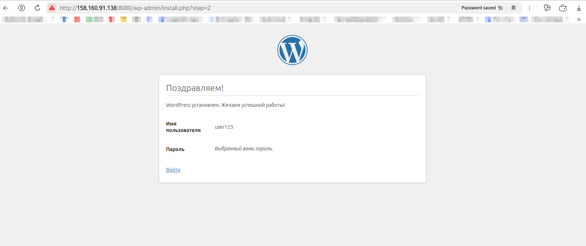
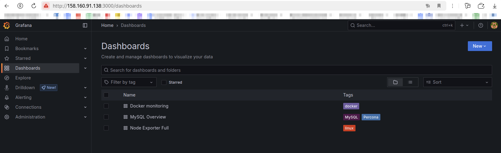

# Развертывание Wordpress

## Используемые технологии

- База данных mysql
- Wordpress
- Docker с docker-compose
- Makefile
- Ansible

## Шаги для поднятия проекта

1. Предполагается, что в системе уже установлен ansible. Если нет - требуется его установить.
2. Создать файл inventory/host по примеру в [hosts.dist](inventory/hosts.dist)
3. Создать файл inventory/group_vars/all.yaml по примеру в [all.dist.yaml](inventory/group_vars/all.dist.yaml)
4. В Makefile запустить target ```up-all``` . Команда в терминале: ```make up-all``` (первый раз поднимается долго!) 
   - Данная команда поднимает
     1. docker
     2. mysql (master + slave)
     3. wordpress
     4. мониторинг (prometheus + grafana + exporters)

## Проверка результата

1. После поднятия проекта можно будет подключиться к базе данных по адресу "ip адрес сервиса:3306"
2. Можно будет перейти на сайт по адресу "ip адрес сервиса:8080"
   

## Мониторинг

Для запуска ansible ролей, связанных с мониторингом, запустить ```make monitoring```

1. Для отображения данных мониторинга используется Grafana
2. Grafana потребляет данные из Prometheus
3. Prometheus потребляет данные из 3-х источников:
   1. node-exporter: собирает данные с виртуальной машины. Применен шаблон для Grafana https://grafana.com/grafana/dashboards/1860-node-exporter-full/
   2. cadvisor: собирает данные по docker контейнерам. Применен шаблон для Grafana https://grafana.com/grafana/dashboards/193-docker-monitoring/
   3. mysqld-exporter: собирает данные из mysql (из мастера и из слейва). Применен шаблон для Grafana https://grafana.com/grafana/dashboards/7362-mysql-overview/
   
Итого в мониторинге Grafana доступны 3 дашборда с мониторингом:

