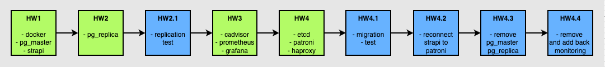

## 📦 Distributed Computing Project: Ansible + Docker + PostgreSQL + Strapi

Проект автоматизирует развёртывание CMS Strapi и PostgreSQL-кластера (мастер + слейв) с помощью **Ansible** и **Docker**

---

### 🏃‍♀️‍➡️ Шаги домашних работ


---

### 📊 Мониторинг (Prometheus + Grafana)


---
### 📌 Зависимости

- Ansible 2.18+
- Коллекция `community.docker`
- Коллекция `community.postgresql`

---

### 📁 Структура

```
IFMO_DistributedComputing_for_DevOps/
├── README.md                 # Документация проекта
├── ansible.cfg               # Конфигурация Ansible
├── inventory.yml             # Инвентарь
├── group_vars/
│   └── all.yml               # Все переменные проекта
│
├── playbooks/                # Плейбуки по домашним заданиям
│   ├── hw1/
│   │   ├── install.yml       # Развёртывание HW1 (PostgreSQL + Strapi)
│   │   ├── remove.yml        # Удаление HW1
│   │   ├── docker/           # Установка Docker
│   │   ├── pg_master/        # Задачи для мастер PostgreSQL
│   │   └── strapi/           # Задачи для Strapi
│   ├── hw2/
│   │   ├── install.yml       # Развёртывание HW2 (PostgreSQL репликация)
│   │   ├── remove.yml        # Удаление HW2
│   │   ├── test.yml          # Тесты репликации
│   │   └── pg_replica/
│   ├── hw3/
│   │   ├── install.yml       # Развёртывание мониторинга
│   │   ├── remove.yml        # Удаление HW3
│   │   ├── cadvisor/
│   │   ├── grafana/
│   │   └── prometheus/
│   └── hw4/
│       ├── install.yml       # Развёртывание Patroni-кластера
│       ├── remove.yml        # Удаление HW4
│       ├── reconnect_to_patroni.yml
│       ├── etcd/
│       ├── haproxy/
│       ├── patroni/
│       └── migration/
│
├── roles/                    # Роли Ansible
│   ├── cadvisor/
│   ├── docker/
│   ├── etcd/
│   ├── grafana/
│   ├── haproxy/
│   ├── migration/
│   ├── patroni/
│   ├── pg_master/
│   ├── pg_replica/
│   ├── prometheus/
│   └── strapi/
│
├── requirements.yml          # Ansible-зависимости
├── .gitignore
├── .ansible-lint.yaml
├── LICENSE
├── hw_steps.png              # Схема шагов
├── monitoring.png            # Скриншот мониторинга
├── .github/
│   └── workflows/
│       └── ansible-lint.yml
├── playbook1.yml             
├── playbook2.yml
├── playbook3.yml
├── playbook4.yml
```

---
### ✅ Функциональность
- 🐳 Установка и удаление Docker через Ansible 
- 🛠 Установка Strapi CMS + PostgreSQL single instance (HW1)
- 🔁 Построение master-replica PostgreSQL (HW2)
- 💾 Backup/Restore PostgreSQL с Ansible-обёрткой 
- 📦 Использование Docker volumes для сохранения данных 
- 🌐 Работа в отдельных Docker-сетях (безопасность)
- 🧠 Проверка репликации: read-only + проверка данных 
- 🧩 Развёртывание кластерного PostgreSQL с Patroni 
- ⚖️ Настройка HAProxy для балансировки и отказоустойчивости 
- 🖥 Подключение Strapi через HAProxy (без изменения конфигурации Strapi)
- 📈 Мониторинг контейнеров через:
  - Prometheus
  - Grafana
  - cAdvisor
- 📡 Визуальный интерфейс для состояния узлов Patroni через REST API
