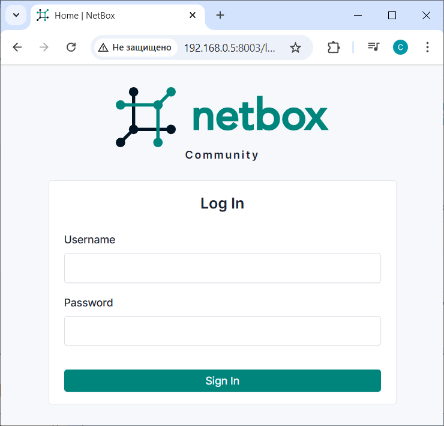
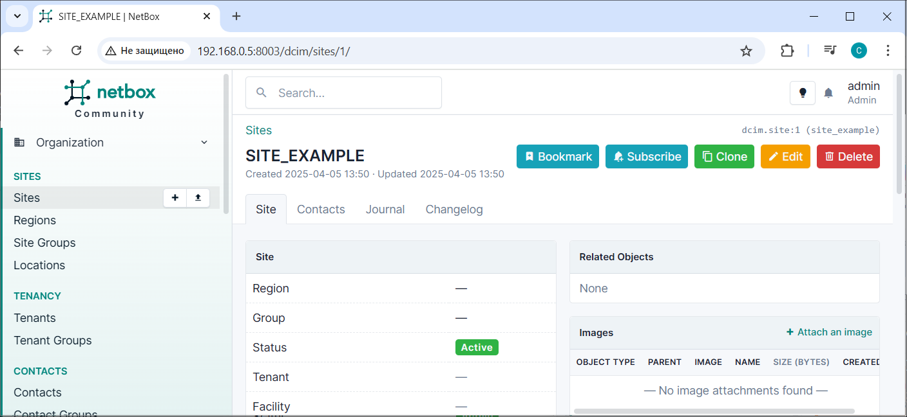
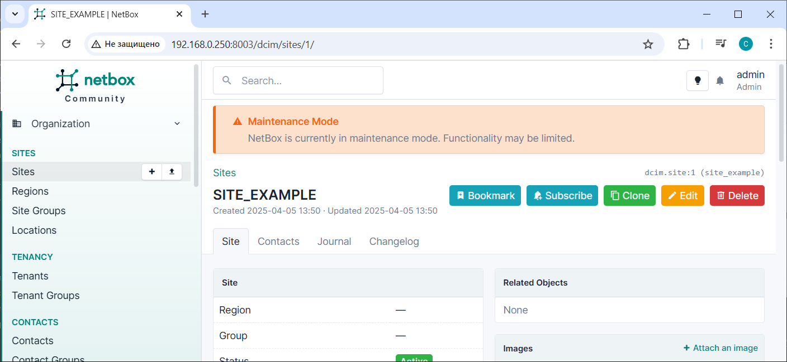
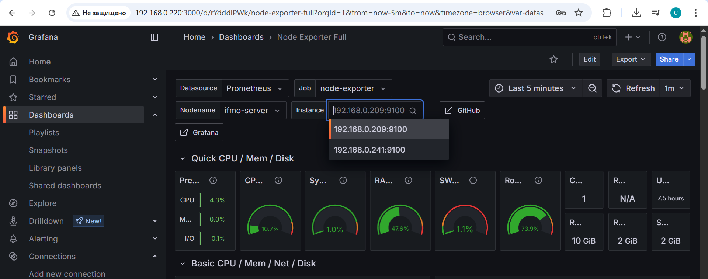

---

# IFMO_DistributedComputing_for_DevOps

Distributed Computing course for DevOps 2025

---

# NetBox Deployment Project

This project provides a structured approach to deploying [NetBox](https://github.com/netbox-community/netbox), an open-source web-based tool for managing and documenting computer networks. The deployment process is automated using Ansible playbooks and Docker Compose, ensuring a streamlined setup and configuration experience.

The project includes:
- **Ansible Playbooks**: For installing Docker and managing the deployment of NetBox.
- **Configuration Files**: Customizable settings for NetBox, including LDAP integration, logging, and plugins.
- **Environment Variables**: Predefined `.env` files for configuring services like PostgreSQL, Redis, and NetBox itself.

---

## Project Structure
```
.
├── LICENSE
├── README.md
├── exporter
│   └── docker-compose_exporter.yml       # Docker Compose for running exporters node-exporter and postgres-exporter
├── install-docker.yml                    # Ansible playbook to install Docker
├── inventory                             # Ansible inventory file
├── mon                                   # Monitoring-related configurations
│   ├── docker-compose_mon.yml            # Docker Compose for Prometheus + Grafana stack
│   ├── grafana                           # Grafana provisioning configs
│   └── prometheus                        # Prometheus configuration
├── netbox                                # NetBox folder
│   ├── docker-compose_master.yml # Docker Compose file for launching NetBox master services
│   ├── docker-compose_slave.yml  # Docker Compose file for launching NetBox slave services
│   └── env                               # Environment variables
├── run-docker-exporter.yml               # Ansible playbooks
├── run-docker-master.yml
├── run-docker-mon.yml
└── run-docker-slave.yml
```


---

## Installation and Deployment

### Prerequisites

1. Ensure that Ansible is installed on your control machine.
2. Update the `inventory` file with the target hosts for both the **master** and **slave**  and **monitoring** servers under appropriate groups.

Example `inventory` file:
```ini
[master]
vm-master ansible_host=192.168.0.209 ansible_user=user ansible_password=123 ansible_become_password=123

[slave]
vm-slave ansible_host=192.168.0.241 ansible_user=user ansible_password=123 ansible_become_password=123

[mon]
vm-mon ansible_host=192.168.0.220 ansible_user=user ansible_password=123 ansible_become_password=123

[all:children]
master
slave
mon
```

### Steps

1. **Install Docker on Both Servers**  
   Run the following command to install Docker on both the **master** and **slave** servers. The playbook targets all hosts (`[all]`) defined in the `inventory` file:
   ```bash
   ansible-playbook -i inventory install-docker.yml
   ```

2. **Start NetBox Services on the Master Server**  
   Use the `run-docker-master.yml` playbook to launch the NetBox services on the **master** server using Docker Compose:
   ```bash
   ansible-playbook -i inventory run-docker-master.yml
   ```

3. **Verify Master Server Deployment**  
   Once the playbook completes successfully, verify that the NetBox services are up and running on the **master** server. You can access the NetBox web interface at:
   ```
   http://<MASTER_IP>:8003/
   ```
   Replace `<MASTER_IP>` with the actual IP address of your **master** server.

4. **Start NetBox Services on the Slave Server**  
   Use the `run-docker-slave.yml` playbook to launch the NetBox services on the **slave** server:
   ```bash
   ansible-playbook -i inventory run-docker-slave.yml
   ```

5. **Verify Slave Server Deployment**  
   Verify that the NetBox services are running correctly on the **slave** server. Ensure that it communicates properly with the **master** server.

6. **Create a Superuser on the Master Server**  
   Log in to the **master** server via SSH and execute the following command to create a superuser account for the NetBox web interface:
   ```bash
   docker compose -f docker-compose_master.yml exec netbox /opt/netbox/netbox/manage.py createsuperuser
   ```
   Follow the prompts to set up the username, email, and password for the superuser.

7. **Run exporters**  
   Use the `run-docker-master.yml` playbook to launch exporeter services on the **master**, **slave** servers using Docker Compose:
   ```bash
   ansible-playbook -i inventory run-docker-exporter.yml
   ```

8. **Run monitoring**  
   Use the `run-docker-mon.yml` playbook to launch prometheus+grafana services on the **monitoring** server using Docker Compose:
   ```bash
   ansible-playbook -i inventory run-docker-mon.yml
   ```

---

## Accessing the NetBox UI

You can access the NetBox web interface on both the **master** and **slave** servers. Below are the details for each:

### Master Server
The **master** server hosts the primary instance of NetBox with full read-write capabilities. You can access it at the following address:  
[http://192.168.0.5:8003/](http://192.168.0.5:8003/)  
Replace `192.168.0.5` with the actual IP or hostname of your **master** server.

Use the superuser credentials created during the deployment process to log in.

### Slave Server
The **slave** server hosts a secondary instance of NetBox, which operates in **maintenance mode**. This means that the database on the slave server is configured as **read-only**, allowing you to view data but not make any changes.  

You can access the slave instance at the following address:  
[http://192.168.0.250:8003/](http://192.168.0.250:8003/)  
Replace `192.168.0.250` with the actual IP or hostname of your **slave** server.

When you log in to the slave instance, you will see a notification indicating that the system is in **maintenance mode**. This is expected behavior due to the read-only database configuration.

### Screenshot
Below is an example of how the NetBox UI might look:



### Screenshot of main Netbox UI


### Screenshot of Netbox UI with **maintenance mode**


### Screenshot of Grafana dashborad



---

## Notes

- The **slave** server is intended for redundancy and failover purposes. It allows you to view data even if the **master** server becomes unavailable.
- Ensure that the IP addresses or hostnames (`192.168.0.5` for master and `192.168.0.250` for slave) match the actual deployment servers.
- For further details about NetBox, refer to the official documentation: [https://netbox.readthedocs.io/](https://netbox.readthedocs.io/)

---