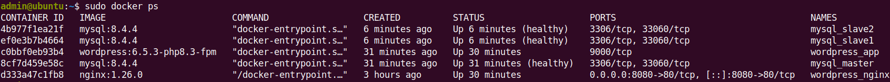
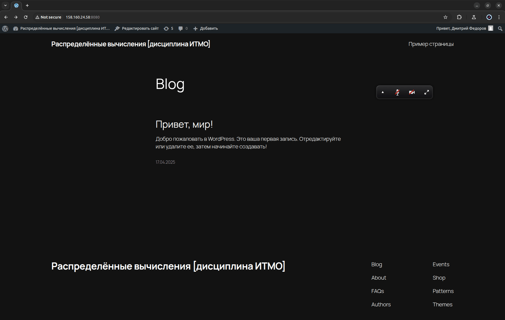

# IFMO_DistributedComputing_for_DevOps

## Развёртывание отказоустойчивого WordPress с GTID-репликацией MySQL (Master-Slave-Slave) с помощью Ansible и Docker Compose

Домашнее задание №2 по дисциплине «Распределённые вычисления» (ИТМО) выполнено с использованием `Ansible` для автоматического развёртывания отказоустойчивого и масштабируемого веб-приложения на основе `WordPress`. Решение построено на основе `Docker Compose v2` и реализует полнофункциональный кластер `MySQL 8.4.4` с `GTID`-репликацией, а также веб-стек на базе `PHP-FPM` и `Nginx`.

---

### Основные возможности

`Ansible` автоматически:

1. Устанавливает `Docker CE` и плагин `Compose` на удалённой виртуальной машине `Linux Ubuntu 24.04 LTS`
2. Создаёт кластер `MySQL` (1 Master + 2 Slaves) с `GTID`‑репликацией, используя отдельные `.cnf` конфигурации
3. Проверяет наличие ранее созданного `Docker`-тома `db_data` и при необходимости выполняет миграцию данных в новый кластер
4. Разворачивает `WordPress`, настраиваемый через переменные окружения
5. Подключает `Nginx` для обслуживания `HTTP`-запросов на порт `8080`

После запуска одного плейбука пользователь получает готовый к работе `WordPress`-сайт:

**http://158.160.24.58:8080**

---

### Структура репозитория

- `requirements.yml`
  - Описывает необходимые коллекции `Ansible`, в частности `community.docker`

- `inventory/hosts.ini`
  - Указывает IP-адрес удалённого хоста, логин и SSH-ключ для подключения

- `group_vars/all.yml`
  - Содержит параметры развёртывания: настройки БД, репликации, `WordPress`, `Docker`

- `site.yml`
  - Главный `Ansible`-плейбук, который вызывает следующие роли:
    - `docker_setup` — установка `Docker`, `Compose`, создание сети, запуск контейнеров
    - `db_setup` — настройка `MySQL`-кластера и миграция данных
    - `wordpress_setup` — подтверждение успешной настройки

- `roles/docker_setup/files/`
  - Конфигурационные файлы:
    - `master.cnf` — конфигурация `Master`-сервера `MySQL`
    - `slave1.cnf` — конфигурация первого репликата
    - `slave2.cnf` — конфигурация второго репликата
    - `nginx.conf` — конфигурация веб-сервера для `WordPress`

---

### Архитектура и взаимодействие компонентов

Все контейнеры разворачиваются в общей изолированной `Docker`-сети `wordpress-network`. Только `nginx` пробрасывает порт наружу:

| Контейнер            | Назначение                       | Сетевые порты        |
|----------------------|----------------------------------|----------------------|
| **mysql_master**     | Главный сервер MySQL             | Внутренняя сеть      |
| **mysql_slave1**     | Реплика MySQL                    | Внутренняя сеть      |
| **mysql_slave2**     | Реплика MySQL                    | Внутренняя сеть      |
| **wordpress_app**    | PHP-FPM-контейнер WordPress      | Внутренняя сеть      |
| **wordpress_nginx**  | Веб-сервер Nginx                 | `8080:80` (извне)    |

Каждый MySQL-контейнер монтирует собственный конфигурационный файл (`master.cnf`, `slave1.cnf`, `slave2.cnf`), где настраивается `GTID`, журнал транзакций, read-only и автопозиционирование.

---

### Docker-тома и персистентность

Для обеспечения надёжного хранения данных используются именованные тома:

- `mysql_master_data`
- `mysql_slave1_data`
- `mysql_slave2_data`
- `wordpress_data`

При наличии старого тома `db_data` система управления конфигурациями `Ansible`:

1. Поднимает временный контейнер `mysql_legacy`
2. Ждёт, пока он станет _healthy_
3. Выполняет `mysqldump` и сразу заливает дамп в новый `mysql_master`
4. Удаляет временный контейнер

---

### Скриншоты работы приложения

<details>
<summary><b>Этап 1: Docker-контейнеры после развёртывания</b></summary>

Контейнеры `MySQL` `Master`/`Slaves`, `WordPress` и `Nginx` успешно запущены.



</details>

<details>
<summary><b>Этап 2: Начальный экран установки WordPress</b></summary>

`WordPress` доступен по адресу и готов к установке.


</details>

<details>
<summary><b>Этап 3: Консоль администратора WordPress</b></summary>

Панель администратора `WordPress`, подтверждающая успешное подключение к `MySQL`-кластеру.


</details>

<details>
<summary><b>Этап 4: Главная страница сайта</b></summary>

Публичная часть сайта `WordPress` — подтверждение успешного развертывания.



</details>

---

### Инструкция по установке и запуску

```bash
# 1. Клонируйте репозиторий
git clone https://github.com/DmitryFedoroff/IFMO_DistributedComputing_for_DevOps.git
cd IFMO_DistributedComputing_for_DevOps

# 2. Создайте и активируйте окружение Python (рекомендуется)
python3 -m venv ~/.venvs/ansible
source ~/.venvs/ansible/bin/activate

# 3. Установите ansible-core
pip install -U "ansible-core>=2.17"

# 4. Установите коллекции Ansible (Docker)
ansible-galaxy collection install -r requirements.yml --force

# 5. Убедитесь, что коллекции установлены (опционально)
ansible-galaxy collection list community.docker

# 6. Запустите плейбук Ansible
ansible-playbook -i inventory/hosts.ini site.yml
```

После выполнения плейбука сайт `WordPress` будет доступен по адресу: http://158.160.24.58:8080

---

### Технические особенности

- **GTID-репликация MySQL**
  - Обеспечивает надёжную идентификацию транзакций и автоматическую синхронизацию реплик при сбое `Master`-сервера.

- **Healthcheck и контроль готовности контейнеров**
  - `Ansible` ожидает, пока каждый `MySQL`-контейнер перейдёт в состояние _healthy_, прежде чем выполнять следующие шаги (репликация, миграция, запуск `WordPress`).

- **Миграция legacy-данных**
  - Если на обнаружен старый том `db_data`, он автоматически переносится в новый кластер.

- **WordPress без шаблона `wp-config.php`**
  - Конфигурация `WordPress` происходит через переменные окружения, что упрощает поддержку и масштабирование.

- **Использование Docker Compose v2**
  - Модули `Ansible` взаимодействуют напрямую с `Compose v2 API`, без необходимости в стороннем бинарнике `docker-compose`.

---

### Управление и обновление приложения

**Повторный запуск с обновлением конфигураций:**
```bash
ansible-playbook -i inventory/hosts.ini site.yml
```

**Полная остановка приложения и удаление всех данных (необратимо!):**
```bash
docker compose --project-directory /opt/wordpress down --volumes --remove-orphans
```

### Контакты

- **Автор**: Дмитрий Федоров
- **Эл. почта**: [fedoroffx@gmail.com](mailto:fedoroffx@gmail.com)
- **Telegram**: [https://t.me/dmitryfedoroff](https://t.me/dmitryfedoroff) 